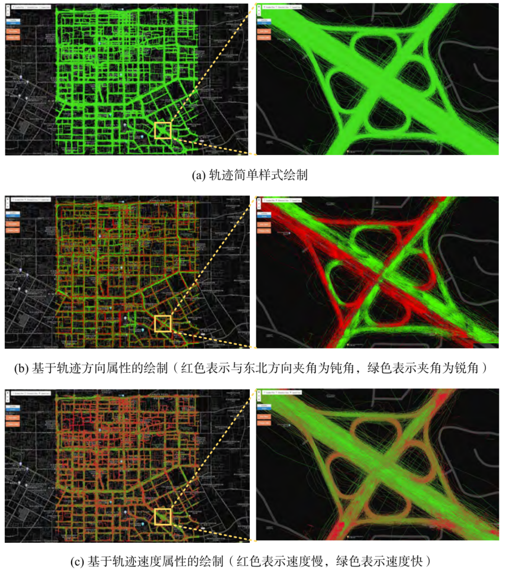

# HiTraj
轨迹大数据交互式实时可视化分析
轨迹可以看作有方向的线要素，可以根据轨迹数据的速度、方向等属性对轨迹数据进行可视化，ben展示了对轨迹数据进行可视化的结果。轨迹数据蕴含丰富的信息，轨迹数据挖掘是当今研究热点之一。在本场景中，被用于对汽车交通通过分析，可以获取很多有意义的结论，包括：1）可以
对道路的轮廓、车流量、车速、单双向等属性信息有更为直观准确的了解；2）可以用于对支持空间决策，如选择用户行驶缓慢的路边位置进行广告牌布设。

***Tab1. Datasets of [Demo]***

| Name           | Type       | Records    | Size                |
| -------------- | ---------- | ---------- | ------------------- |
| GAIA 西安滴滴轨迹|  线 | 148,747 | 37,268,701 条轨迹段|
| GAIA 成都滴滴轨迹|  线 | 267,862 | 52,839,430 条轨迹段|

***Tab2.  Demo Environment***

| Item             | Description                                      |
| ---------------- | ------------------------------------------------ |
| CPU              | 4core*2, Intel(R) Xeon(R) CPU E5-2680 v3@2.50GHz |
| Memory           | 32 GB                                            |
| Operating System | Centos7                                          |

## [Online Demo](http://www.higis.org.cn:8080/TrajVISDEMO)

## Contact:

Mengyu Ma@ National University of Defense Technology

Email: mamengyu10@nudt.edu.cn

Tel:+8615507487344
